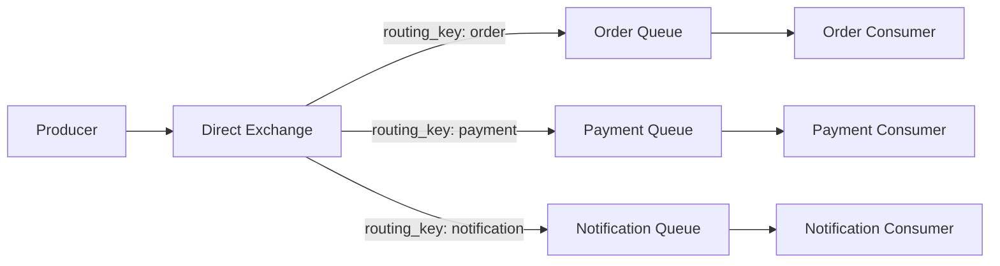
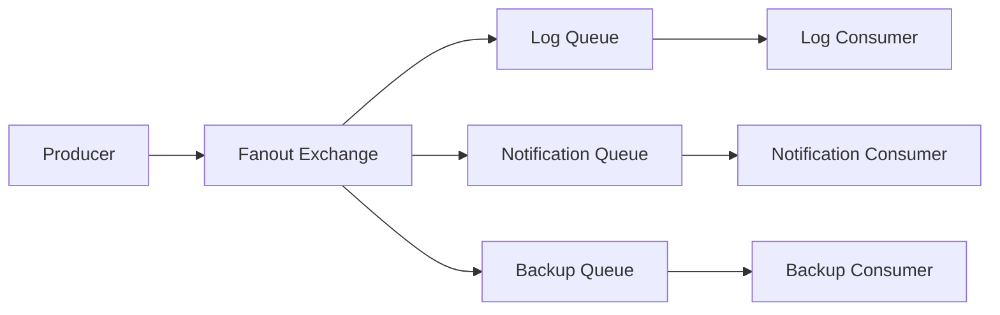
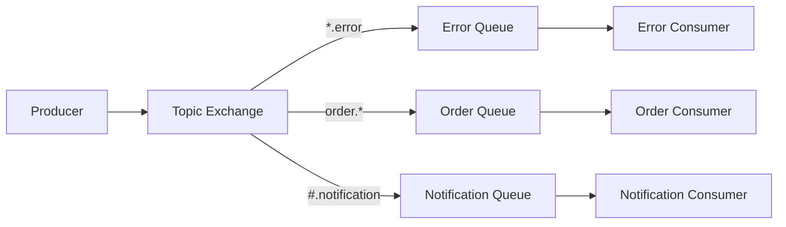
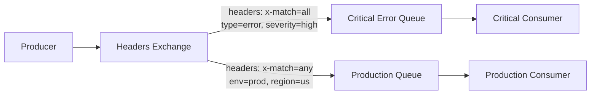
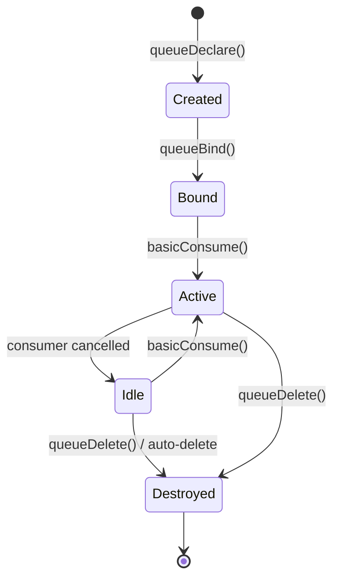
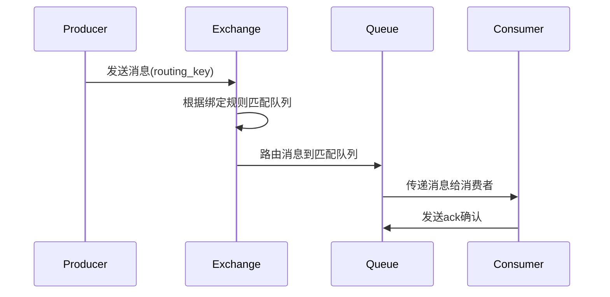
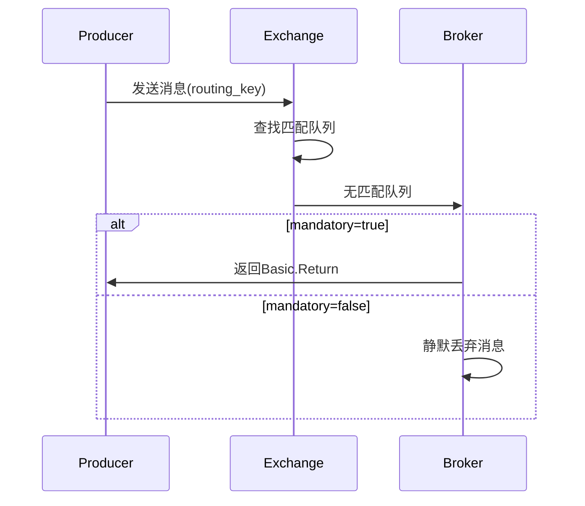
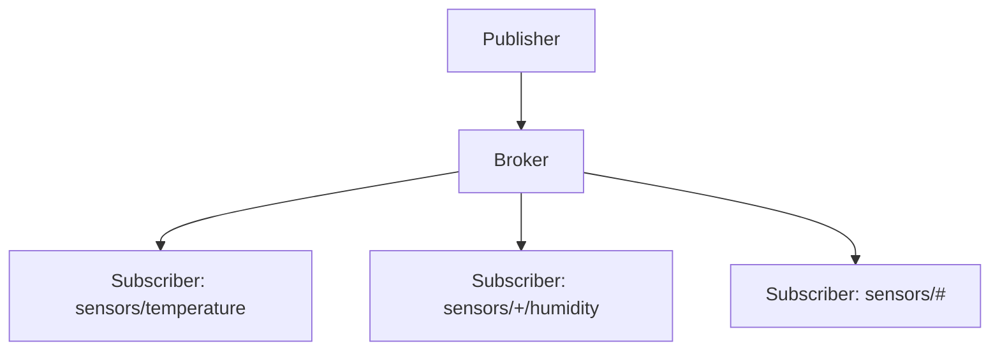

# AMQP Exchange、Routing Key、Queue 与 MQTT Topic 对比

## 1. AMQP 和 MQTT 简介

### AMQP (Advanced Message Queuing Protocol)
AMQP是一个面向消息的中间件协议，提供了丰富的消息路由功能。它采用生产者-交换机-队列-消费者的架构，支持复杂的消息路由模式。

### MQTT (Message Queuing Telemetry Transport)
MQTT是一个轻量级的发布/订阅消息传输协议，主要用于物联网场景。它采用简单的主题(topic)模型进行消息路由。

## 2. AMQP 核心组件详解

### 2.1 Producer (生产者)
消息的发送者，将消息发送到Exchange。

### 2.2 Exchange (交换机)
消息路由的枢纽，负责接收生产者发送的消息并根据路由规则将消息路由到相应的队列。

#### Exchange 创建方式
- **自动创建**: 在声明队列绑定时自动创建
- **手动声明**: 显式调用exchangeDeclare方法创建
- **持久化Exchange**: 服务器重启后仍然存在
- **临时Exchange**: 连接关闭后自动删除
- **内置Exchange**: 如amq.direct, amq.fanout, amq.topic等

#### Exchange 类型及功能差异

##### Direct Exchange (直连交换机)

- **功能**: 精确匹配Routing Key
- **使用场景**: 点对点消息传递，如订单处理、支付处理

##### Fanout Exchange (扇出交换机)

- **功能**: 广播消息到所有绑定的队列
- **使用场景**: 广播通知、日志分发、缓存更新

##### Topic Exchange (主题交换机)

- **功能**: 模式匹配Routing Key（支持*和#通配符）
- **使用场景**: 基于类别的消息路由，如错误日志、订单状态更新

##### Headers Exchange (头交换机)

- **功能**: 基于消息头属性匹配
- **使用场景**: 复杂的消息过滤，基于多个条件路由

### 2.3 Routing Key (路由键)
- 生产者发送消息时指定的键
- Exchange根据Routing Key和绑定规则决定消息路由
- 在Direct和Topic Exchange中起主要作用

### 2.4 Queue (队列)
消息的存储容器，消费者从队列中获取消息。

#### Queue 创建方式
- **自动创建**: auto-declare参数为true时自动创建
- **手动声明**: 显式调用queueDeclare方法创建
- **持久化队列**: 服务器重启后仍然存在
- **非持久化队列**: 内存中存储，服务器重启后消失
- **独占队列**: 仅供当前连接使用
- **共享队列**: 多个消费者可以共享

#### Queue 销毁机制
- **自动删除**: auto-delete参数为true时，当所有消费者断开连接后自动删除
- **显式删除**: 调用queueDelete方法手动删除
- **服务器清理**: 服务器重启时非持久化队列被清除

### 2.5 Consumer (消费者)
消息的接收者，从队列中获取并处理消息。

## 3. 消息路由流程

### 3.1 正常消息流

### 3.2 匹配失败处理
当消息无法匹配到任何队列时：

## 4. 与 MQTT Topic 对比

### 4.1 MQTT Topic 模型

- **简单主题**: 基于字符串匹配
- **通配符**: 
  - `+` 单级通配符
  - `#` 多级通配符
- **直接发布/订阅**: 没有中间路由组件

### 4.2 AMQP vs MQTT 对比表

| 特性 | AMQP | MQTT |
|------|------|------|
| 路由机制 | Exchange + Routing Key | Topic |
| 消息确认 | 支持多种确认模式 | QoS 0/1/2 |
| 消息持久化 | 队列和消息都可持久化 | 仅消息可持久化 |
| 路由灵活性 | 高（多种Exchange类型） | 中（通配符匹配） |
| 复杂度 | 高 | 低 |
| 适用场景 | 企业级应用、复杂路由 | IoT、移动设备、简单发布订阅 |

## 5. 使用场景建议

### 选择 AMQP 当：
- 需要复杂的消息路由逻辑
- 需要消息确认和事务支持
- 企业级应用，需要高可靠性
- 需要多种消息模式（点对点、发布订阅）

### 选择 MQTT 当：
- IoT设备通信
- 网络带宽受限的环境
- 简单的发布/订阅需求
- 移动设备消息推送

## 6. 总结

AMQP提供了更丰富和灵活的消息路由机制，通过Exchange、Routing Key和Queue的组合可以实现复杂的消息流控制。而MQTT则提供了更简单轻量的主题模型，适合资源受限的环境。

理解这两种协议的区别有助于根据具体需求选择合适的消息协议。AMQP适合需要精细控制的企业应用，而MQTT适合简单的物联网和移动应用场景。
